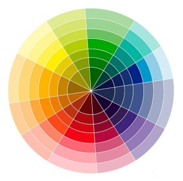

# imgColorPicker

Available in [npm](https://www.npmjs.com/package/img-color-picker) 


<p align="center">
  
</p>


## Setup
#### Install dependencies
``` 
npm install imgColorPicker --save
``` 


## Usage
#### Ex:
```html

```

```js
import imgColorPicker from 'imgColorPicker'

try {
  let obj = new imgColorPicker( "#image" )
  obj.listener(function( color ){
    console.table([ ["R", "G", "B"],   [ color[0], color[1], color[2] ]  ])
  })
} 
catch (err) {
  console.error(err)
}
``` 

## Or in script tag
```
<script src="./PATH/node_modules/imgColorPicker/dist/imgColorPicker.js"></script>
```

[Demo](https://gustavosoriano.github.io/imgColorPicker/)
